## ASTER  
`An Attentional Scene Text Recognizer with Flexible Rectification`  
Задача: распознать слово на изображении (изображение предварительно вырезано из сцены с помощью детектора и текст занимает большую часть изображения)  
Модель состоит из двух частей: ректификатора (преобразователя изображения, выпрямителя текста) и распознавателя текста на преобразованном изображении  
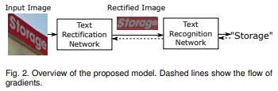
# Rectification Network  
Идея: срегрессировать с помощью сверточной сети параметры для преобразования, после чего произвести генерацию плоского (32x100) изображения  
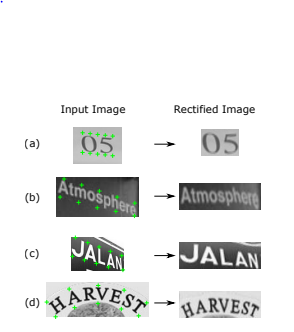  
На самом деле параметризуется преобразование плоского изображения в исходное, после чего происходит sampling плоского изображения  
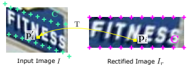  
Схема rectification network  
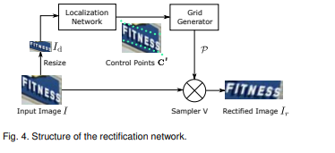  
Шаги:  
  1. Сделать Resize исходной картинки для передачи в Localization Network
  2. Срегрессировать Control Points C' с помощью сверточной сети Localization Network
  3. Посчитать преобразование (Grid Generator)
  4. Произвести sampling плоской картинки из исходной картинки (картинки исходного размера, до Resize)

Важно понимать, что обучаемыми шагами является только 2й, в то время как 3 и 4 -- это просто дифференцируемые преобразования, позволяющие передавать градиенты сверточной сети (шагу 2)
Подробнее:  
**Localization Network**  
Сверточная сеть: несколько сверточных слоев с max пулингами, после которых идет линейный слой с выходом размера 2k: (2k точек: k / 2 под текстом, k / 2 над текстом).  
**Grid Generator**  
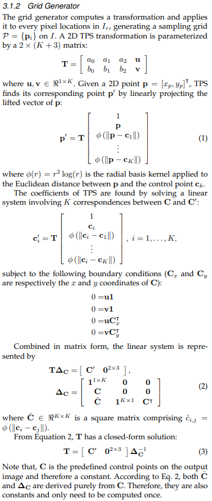  
Преобразование Thin-Plate-Spline (TPS)параметризовано матрицей T, которая находится из условия (1): контрольные точки C должны переходить в контрольные точки C', а так же удовлетворять некоторым уравнениям. Все эти условия неложно выражаются в матричной форме (2) и все преобразование получается дифференцируемым  
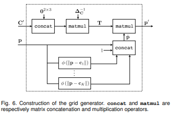  
**Sampler**  
После преобразования точка p' может оказаться вне картинки, поэтому происходит clipping координат.
Сам Sampling -- это простая интерполяция точек в районе p'. В самом простом случае -- взятие значения ближайшей точки. Один из вариантов:  
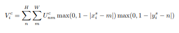  
Градиент тоже можно найти:  
 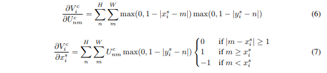
# Recognition Network
Всю сеть хорошо иллюстрирует картинка из статьи  
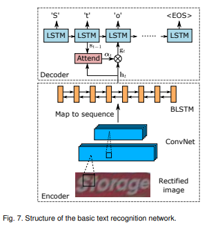  
**Encoder**   
Картинка проходит через сверточную сеть, после которой получается feature map размера h x w x d. Эта feature map интерпретируется как последовательность размера w векторов размерности h x d. Эта последовательность передается в bidirectional LSTM, получая новую последовательность.  
**Decoder**  
Представляет собой обычную реккурентную сеть с механизмом attention. Inference производится посредством beam-search  
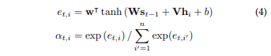  
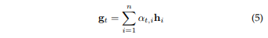  
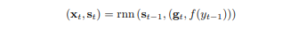  
**Bidirectional Decoder**  
Одновременно обучаются два декодера: один предсказывает слово справа налево, другой слева направо. При inference берется одно из двух предсказаний с наибольшей вероятностью (посимвольная сумма log softmax). Данная оптимизация немного улучшает качество модели.  
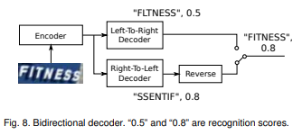  
# Результаты  
На момент выхода статьи (2018 год) модель показывала наилучшее или близкое к наилучшему качество на большинстве тестовых датасетов (IIIT5k, SVT, IC03, IC13, IC15, SVTP, CUTE) по сравнению к остальным моделям  
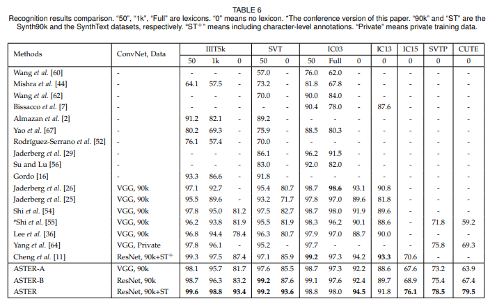
